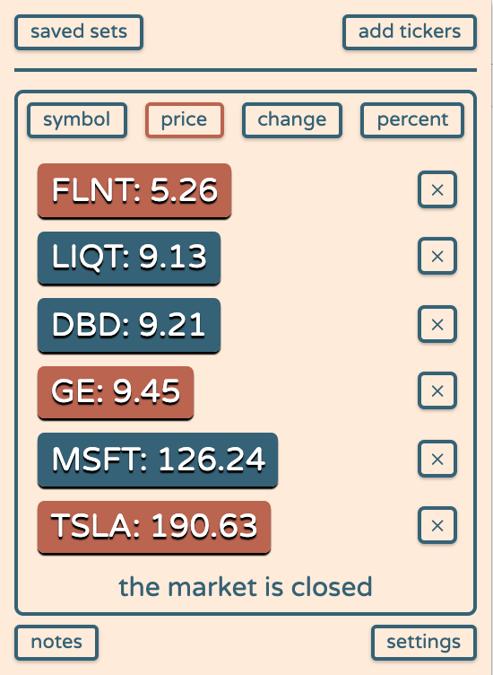

# stocka
>a browser extension that helps you monitor your portfolio with ease

this repository includes all extension files and resources with the exception of upgrade scripts

many of the features outlined in this document are unlocked with the upgraded version: stocka for investors

 [download stocka for chrome](https://aaronchapman.github.io/padseek)
 [download stocka for firefox](https://aaronchapman.github.io/padseek)

---

## adding symbols

visual | features
--- | ---
 | **`adding symbols:`** _the regex is pretty forgiving, just try to be accurate with your input (OTC & FOREX not yet supported)_  **`copy symbol set:`** _copies your current symbol set to your clipboard so you can share it or whatever_  

## viewing market data

visual | features
--- | ---
 | **`company website:`** _a link to the company's website_  **`share price graph:`** _stock share price over specified amounts of time_  **`market data points:`** _change, high, low, & volume traded over specified amount of time, as well as the stock's market cap_  **`news articles:`** _articles and listings that mention the symbol from a variety of sources_

## sorting symbols

visual | features
--- | ---
  | **`sort by symbol:`** _alphabetically, ascending or descending_  **`sort by share price`** _current share price, ascending or descending_  **`sort by day change:`** _share price change, ascending or descending_  **`sorty by day change (percentage):`** _share price change as a percentage value, ascending or descending_

## saved symbol sets

visual | features
--- | ---
 | **`saved symbol sets:`** _a list of symbol sets that have been named and saved_  **`name current symbol set:`** _give your shit a name_  **`save symbol set:`** _honestly it's pretty straight-forward_  **`delete symbol set:`** _deletes currently loaded symbol set (if saved)_

---

**`themes ▫️▪️`**

regular theme | dark theme
--- | ---
 | 

**switch themes using the options in top right corner**

---

**see other/to-do.txt for to-do list**