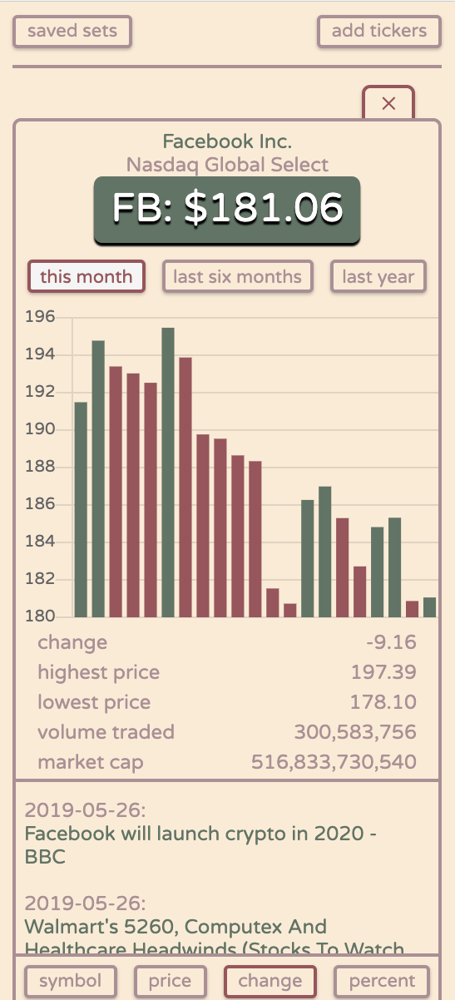

# stocka
>a browser extension that helps you monitor your portfolio with ease

this repository includes all extension files and resources with the exception of upgrade scripts
many of the features outlined in this document are unlocked with the upgraded version: stocka for investors

 [download stocka for chrome](https://chrome.google.com/webstore/detail/stocka/lmjgcjcjefogafhmhefbibnnkpgkkdgh)
 firefox download coming soon

---

## viewing market data

visual | features
--- | ---
 | **`company website`** a link to the company's website  **`share price graph`** stock share price over specified amounts of time  **`exchange`** which exchange the symbol is listed on  **`share price graph`** stock share price over specified amounts of time  **`market data points`** change, high, low, & volume traded over specified amount of time, as well as the stock's market cap  **`news articles`** articles and listings that mention the symbol from a variety of sources

## adding symbols

visual | features
--- | ---
 | **`adding symbols`** the regex is pretty forgiving, just try to be accurate with your input (OTC & FOREX not yet supported)  **`copy symbol set`** copies your current symbol set to your clipboard so you can share it or whatever

## sorting symbols

visual | features
--- | ---
 | **`sort by symbol`** alphabetically, ascending or descending  **`sort by share price`** current share price, ascending or descending  **`sort by day change`** share price change, ascending or descending  **`sorty by day change (percentage)`** share price change as a percentage value, ascending or descending

## saved symbol sets

visual | features
--- | ---
 | **`saved symbol sets`** a list of symbol sets that have been named and saved  **`name current symbol set`** give your shit a name  **`save symbol set`** honestly it's pretty straight-forward  **`delete symbol set`** deletes currently loaded symbol set (if saved)

## notes

visual | features
--- | ---
 | **`saving notes`** if you need 'em

## settings

visual | features
--- | ---
 | **`extension upgrade`** if user has not upgraded, an option to do so will appear in the settings panel  **`theme options`** six different themes to choose from (visuals below)  **`market data chart type`** toggles bar graph or line graph chart type in market data panel

---

**`theme previews`**

default | sepia
--- | ---
 | 

classic | midnight
--- | ---
 | 

tangerine | berry
--- | ---
 | 

---

**see other/to-do.txt for to-do list**
